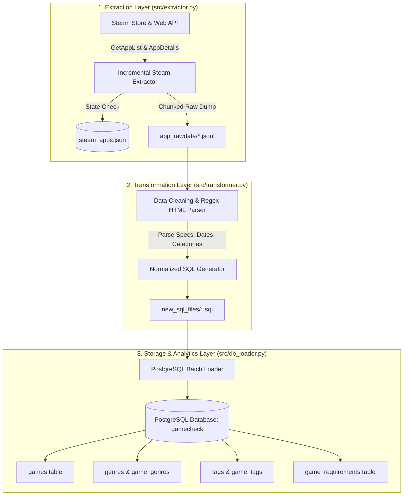
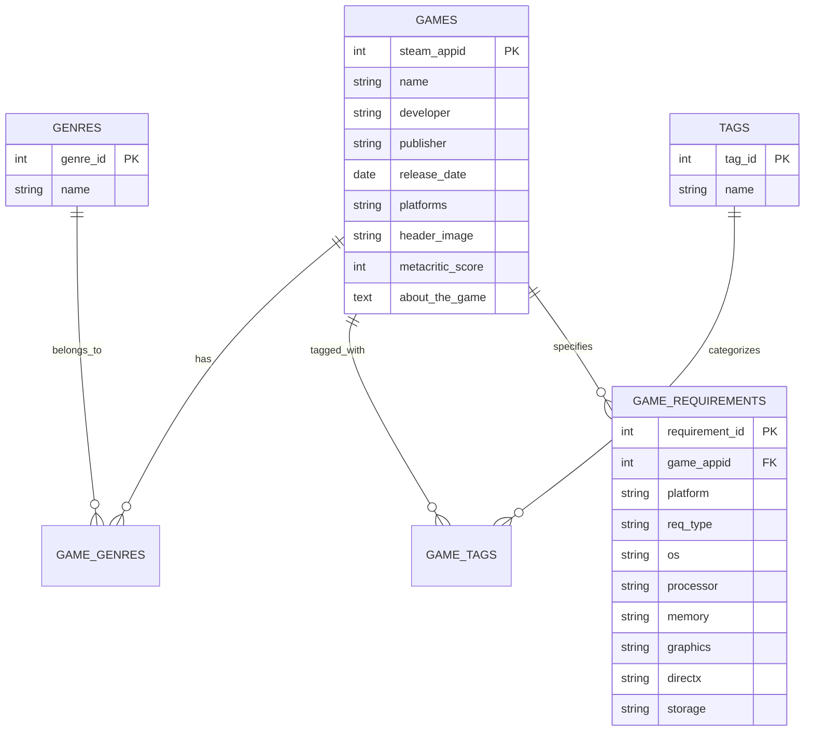

# 🎮 Steam Data Extraction & Storage ETL Pipeline

[](https://www.python.org/)
[](https://www.postgresql.org/)
[](LICENSE)

An end-to-end Data Engineering pipeline built in Python and PostgreSQL to extract, transform, normalize, and store large-scale video game metadata from the official **Steam Web API**.

Features incremental web scraping, rate-limiting resilience, automated regex-based HTML parsing for system requirements (CPU, GPU, RAM, Storage), normalized 3NF PostgreSQL relational database schema, and Databricks cloud lakehouse integration.

---

## 📐 Pipeline Architecture



---

## 🗄️ Entity-Relationship Diagram (ERD)



---

## ✨ Key Features

1. **Incremental Data Extraction**: Automatically tracks fetched games in `steam_apps.json` to process only new game releases, preventing redundant API calls.
2. **System Requirements HTML Parser**: Uses regex parsing to break down unstructured HTML requirement strings from Steam into structured database columns (`os`, `processor`, `memory`, `graphics`, `storage`, `directx`).
3. **Normalized 3NF PostgreSQL Schema**: Designed with junction tables (`game_genres`, `game_tags`) for efficient querying, clean primary/foreign key relationships, and performance B-Tree indexes.
4. **Idempotent Storage Execution**: All SQL queries utilize `INSERT ... ON CONFLICT DO UPDATE` (UPSERT) semantics, allowing pipeline restarts without data duplication or key conflicts.
5. **Databricks & Cloud Lakehouse Ready**: Includes dedicated DBFS and Databricks secret scope integration scripts under `cloud_databricks/`.

---

## 📁 Repository Structure

```
steam-data-pipeline/
├── .env.example                  # Configuration template for Steam API Key & Database secrets
├── .gitignore                    # Git rules for credentials, virtual environment & raw data
├── README.md                     # Main GitHub documentation & analytical queries
├── SETUP_GUIDE.md                # Detailed step-by-step setup walkthrough
├── requirements.txt              # Project dependencies
├── sql/
│   └── schema.sql                # Complete PostgreSQL DDL (Tables, Indexes, Constraints)
├── src/
│   ├── __init__.py
│   ├── config.py                 # Centralized configuration & environment loader
│   ├── extractor.py              # Steam API client with rate limiting & state persistence
│   ├── transformer.py            # JSONL parser & HTML requirement text parser
│   ├── db_loader.py              # PostgreSQL database connection & loader
│   └── pipeline.py               # Master CLI pipeline orchestrator
└── cloud_databricks/
    ├── README.md                 # Databricks setup instructions
    ├── 01_extract_steam_data.py  # Databricks DBFS extraction script
    └── 02_process_and_load.py    # Databricks PySpark/Python loader script
```

---

## 🚀 Quick Start Guide

### 1. Clone & Activate Virtual Environment
```bash
git clone https://github.com/your-username/steam-data-pipeline.git
cd steam-data-pipeline

# Create & activate virtual environment
python -m venv venv
# On Windows: .\venv\Scripts\Activate.ps1
# On Linux/Mac: source venv/bin/activate

pip install -r requirements.txt
```

### 2. Configure Environment Variables
Copy `.env.example` to `.env` and set your credentials:
```bash
cp .env.example .env
```

### 3. Initialize Database Schema
```bash
psql -h localhost -U postgres -d gamecheck -f sql/schema.sql
```

### 4. Run Pipeline
```bash
# Run complete end-to-end pipeline
python -m src.pipeline --stage all
```

*For detailed prerequisite configuration, see [SETUP_GUIDE.md](file:///c:/Users/hp/Downloads/Finalsteamdata/Finalsteamdata/steam-data-pipeline/SETUP_GUIDE.md).*
